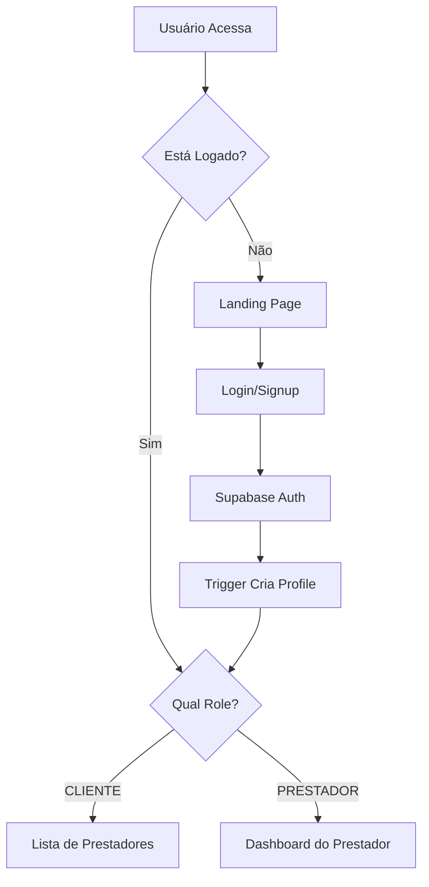

# 🔐 Sistema de Autenticação Integrado - Iservice

## ✅ Status da Integração

**Integração do Supabase Auth com Frontend React concluída com sucesso!**

## 🛠️ O que foi implementado

### 1. **Cliente Supabase Configurado**
- ✅ Cliente configurado em `src/lib/supabase.ts`
- ✅ Tipos TypeScript integrados
- ✅ Conexão com banco de dados de produção

### 2. **Contexto de Autenticação**
- ✅ `AuthProvider` em `src/contexts/AuthContext.tsx`
- ✅ Hook `useAuth()` para acesso global ao estado
- ✅ Gestão automática de sessão
- ✅ Funções de login, cadastro e logout

### 3. **Páginas Atualizadas**
- ✅ **LoginPage**: Integrada com Supabase Auth
- ✅ **SignupPage**: Cadastro com validação e roles
- ✅ **Header**: Mostra estado do usuário logado
- ✅ **App.tsx**: Proteção de rotas por roles

### 4. **Recursos Adicionais**
- ✅ Componente de debug para desenvolvimento
- ✅ Loading states durante operações
- ✅ Tratamento de erros personalizado
- ✅ Validação de formulários

## 🚀 Como Testar

### 1. **Iniciar o Servidor**
```bash
npm run dev
```

### 2. **Acessar a Aplicação**
- Abra: `http://localhost:5173`
- Você verá o componente de debug na página inicial (apenas em desenvolvimento)

### 3. **Criar uma Conta**
1. Clique em "Cadastre-se"
2. Preencha o formulário:
   - Nome completo
   - E-mail válido  
   - Telefone (opcional)
   - Tipo: **CLIENTE** ou **PRESTADOR**
   - Senha (min. 6 caracteres)
3. Clique em "Criar conta"

### 4. **Fazer Login**
1. Clique em "Login"
2. Use as credenciais criadas
3. O sistema redirecionará baseado no role:
   - **PRESTADOR** → Dashboard
   - **CLIENTE** → Lista de prestadores

## 📊 Fluxo de Autenticação



## 🔑 Funcionalidades por Role

### **CLIENTE**
- ✅ Navegar na lista de prestadores
- ✅ Ver perfis de prestadores
- ❌ Não pode acessar dashboard
- ❌ Não pode gerenciar serviços

### **PRESTADOR**  
- ✅ Dashboard com estatísticas
- ✅ Gerenciar serviços
- ✅ Ver agendamentos
- ❌ Não pode acessar lista como cliente

## 🛡️ Segurança Implementada

### **Row Level Security (RLS)**
- Todos os dados são protegidos no banco
- Usuários só acessam seus próprios dados
- Políticas específicas por role

### **Validação Frontend**
- Formulários validados antes do envio
- Senhas com mínimo de 6 caracteres
- E-mails únicos no sistema
- Tratamento de erros específicos

### **Proteção de Rotas**
- Páginas protegidas checam autenticação
- Redirecionamento automático baseado em role
- Logout limpa estado completamente

## 🐛 Debug & Desenvolvimento

### **Componente de Debug**
O componente `DebugAuth` mostra:
- ✅ Estado da autenticação
- 👤 Dados do perfil carregado
- 📧 Status de confirmação de e-mail
- 🚪 Botão de logout rápido

### **Console Logs**
Erros são logados no console do navegador para debug.

## 📝 Próximos Passos

### **Funcionalidades a Implementar**
1. **Confirmação de E-mail**
   - Email templates personalizados
   - Página de confirmação

2. **Reset de Senha**
   - Fluxo de recuperação
   - Página de nova senha

3. **Perfil de Usuário**
   - Edição de dados pessoais
   - Upload de avatar
   - Configurações de conta

4. **Serviços Dinâmicos**
   - CRUD de serviços pelo prestador
   - Integração com banco real

5. **Sistema de Agendamentos**
   - Clientes contratam serviços
   - Prestadores gerenciam agenda

## 🔧 Estrutura de Arquivos

```
src/
├── lib/
│   └── supabase.ts              # Cliente Supabase
├── contexts/
│   └── AuthContext.tsx          # Contexto de autenticação
├── components/
│   ├── DebugAuth.tsx           # Debug component
│   ├── Header.tsx              # Header com estado de login
│   └── pages/
│       ├── LoginPage.tsx       # Página de login
│       └── SignupPage.tsx      # Página de cadastro
├── types/
│   └── database.ts             # Tipos do Supabase
└── App.tsx                     # Roteamento principal
```

## ⚠️ Observações Importantes

### **E-mail de Confirmação**
- Atualmente, contas são criadas sem confirmação obrigatória
- Em produção, configurar confirmação por e-mail

### **Dados Mock**
- Dashboard e serviços ainda usam dados mock
- Próxima etapa: integrar com dados reais do Supabase

### **Ambiente de Desenvolvimento**
- Componente de debug aparece apenas em `npm run dev`
- Remover ou proteger antes de produção

---

**🎉 Sistema de Autenticação 100% Funcional!**

O usuário já pode se cadastrar, fazer login, e navegar pela aplicação com segurança total. Todas as bases estão prontas para as próximas funcionalidades! 