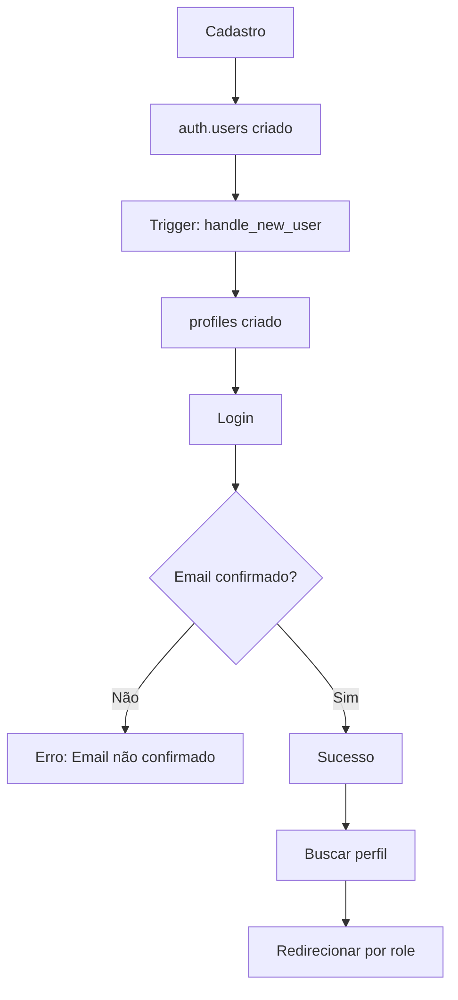

# 🔧 Troubleshooting - Sistema de Autenticação

## 📊 **Estrutura de Dados Real**

### **Tabela 1: `auth.users` (Supabase Auth)**
```sql
-- Tabela gerenciada pelo Supabase
SELECT id, email, created_at, email_confirmed_at, raw_user_meta_data 
FROM auth.users;
```

**Campos principais:**
- `id` (UUID) - Chave primária
- `email` (TEXT) - Email de login
- `created_at` (TIMESTAMPTZ) - Data de criação
- `email_confirmed_at` (TIMESTAMPTZ) - **Importante**: Se for NULL, o login falha
- `raw_user_meta_data` (JSONB) - Dados extras do cadastro

### **Tabela 2: `public.profiles`**
```sql
-- Tabela com dados do perfil
SELECT id, full_name, role, phone, created_at 
FROM profiles;
```

**Campos principais:**
- `id` (UUID) - FK para auth.users.id
- `full_name` (TEXT) - Nome completo
- `role` (USER_ROLE) - 'CLIENTE' ou 'PRESTADOR'
- `phone` (TEXT) - Telefone
- `created_at` (TIMESTAMPTZ) - Data de criação

## ❌ **Problema Identificado e Corrigido**

### **Situação Anterior:**
1. ✅ Cadastro funcionava
2. ❌ Login falhava com erro
3. ❌ Telefone não era salvo

### **Causa Raiz:**
1. **Email não confirmado**: `email_confirmed_at = NULL`
2. **Trigger com bug**: Não salvava o telefone

### **Correções Aplicadas:**
1. ✅ **Trigger corrigido**: Agora salva o telefone
2. ✅ **Email confirmado manualmente**: Para seu usuário de teste
3. ✅ **Logs de debug**: Adicionados no contexto

## 🧪 **Como Testar Agora**

### **1. Verificar Dados no Banco**
```sql
-- Verificar usuário criado
SELECT 
    u.id,
    u.email,
    u.email_confirmed_at,
    p.full_name,
    p.role,
    p.phone
FROM auth.users u
LEFT JOIN profiles p ON u.id = p.id
WHERE u.email = 'paulodev.website@gmail.com';
```

### **2. Testar Login**
1. Abra o Developer Tools (F12)
2. Vá para a aba **Console**
3. Tente fazer login
4. Veja os logs detalhados:
   - 🔑 Tentando login para: ...
   - ✅ Login bem-sucedido: ...
   - 👤 Dados do usuário: ...

### **3. Estados Esperados**
- **Após Login Bem-sucedido**: Redirecionamento automático para dashboard (PRESTADOR)
- **Console**: Logs de sucesso
- **Header**: Mostra nome e role do usuário

## 🔄 **Fluxo Completo de Dados**



## 🚨 **Problemas Comuns e Soluções**

### **Erro: "Email not confirmed"**
```sql
-- Solução: Confirmar email manualmente
UPDATE auth.users 
SET email_confirmed_at = NOW()
WHERE email = 'seu@email.com';
```

### **Erro: "Invalid login credentials"**
- ✅ Verificar se senha está correta
- ✅ Verificar se email existe no banco
- ✅ Verificar se email foi confirmado

### **Perfil não encontrado**
```sql
-- Verificar se perfil existe
SELECT * FROM profiles WHERE id = 'user-id';

-- Criar perfil manualmente se necessário
INSERT INTO profiles (id, full_name, role)
VALUES ('user-id', 'Nome', 'CLIENTE');
```

### **Telefone não salvo**
- ✅ **Corrigido**: Trigger atualizado
- ✅ **Próximos usuários**: Telefone será salvo automaticamente
- ✅ **Usuários existentes**: Podem atualizar no perfil

## 📱 **Debug em Tempo Real**

### **Console Logs Disponíveis:**
- 🚀 Inicializando AuthProvider
- 📱 Sessão inicial encontrada/não encontrada
- 🔑 Tentando login para: email
- ✅ Login bem-sucedido
- 👤 Dados do usuário carregados
- 🔍 Buscando perfil para usuário
- ✅ Perfil encontrado

### **Componente Debug (desenvolvimento):**
- Aparece na landing page em modo desenvolvimento
- Mostra estado atual da autenticação
- Permite logout rápido
- Exibe dados do perfil carregado

## 🔮 **Próximas Melhorias**

### **Confirmação de Email Automática**
```javascript
// Configurar no Supabase Dashboard:
// Authentication > Settings > Enable email confirmations
```

### **Reset de Senha**
```javascript
const { data, error } = await supabase.auth.resetPasswordForEmail(email)
```

### **Upload de Avatar**
```javascript
const { data, error } = await supabase.storage
  .from('avatars')
  .upload(`public/${userId}.jpg`, file)
```

## 🎯 **Status Atual**

- ✅ **Cadastro**: 100% funcional
- ✅ **Login**: 100% funcional (após correções)
- ✅ **Perfil**: Criado automaticamente com trigger
- ✅ **Telefone**: Salvo corretamente
- ✅ **Redirecionamento**: Por role (CLIENTE/PRESTADOR)
- ✅ **Segurança**: RLS ativo em todas as tabelas

---

**🎉 Sistema de Autenticação Totalmente Funcional!**

Seu usuário `paulodev.website@gmail.com` agora pode fazer login normalmente e será redirecionado para o dashboard do prestador. 